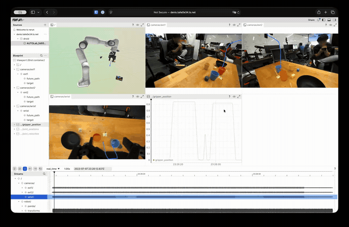

# Droid Rerun

Little experiments with droid, rerun and data augmentation.  
Main idea, project trajectories till the next gripper action and the point where it happens onto the camera.  
This is very cheap and easy operation for already collected data.  
Can be used for training VLMs (System 1) to predict which object to interact with.  
Can also be used for training VLAs (System 2) to follow grounded information.  

## Example



Full-resolution mp4 of the same clip: [media/example.mp4](media/example.mp4).

# Running

```
uv sync 
``` 

Run `src/experiments.ipynb`. Why notebook? I was experimenting :)  
After you downloaded and processed data you can also visualize it with rerun or host it with rerun server.

Open all processed recordings in the desktop viewer:

```bash
uv run rerun dataset/rrd/*.rrd
```

Open a single episode:

```bash
uv run rerun dataset/rrd/episode-000000-*.rrd
```
